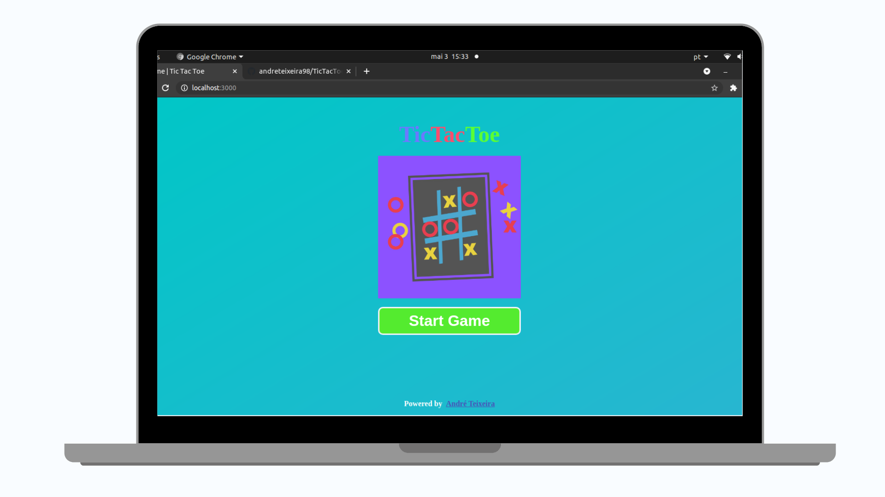

# TicTacToe with ReactJS TypeScript NextJS


  <a 
    href="https://tictactoe-five.vercel.app/"
    target="_blank"
  >
  
  </a>

  <br/>
  <br/>
  <br/>

<!-- PROJECT SHIELDS -->
[![Contributors][contributors-shield]][contributors-url]
[![Forks][forks-shield]][forks-url]
[![Stargazers][stars-shield]][stars-url]
[![Issues][issues-shield]][issues-url]
[![MIT License][license-shield]][license-url]
[![LinkedIn][linkedin-shield]][linkedin-url]

<!-- PROJECT LOGO -->


<!-- TABLE OF CONTENTS -->

  <ol>
    <li>
      <a href="#about-the-project">About The Project</a>
      <ul>
        <li><a href="#built-with">Built With</a></li>
      </ul>
    </li>
    <li>
      <a href="#getting-started">Getting Started</a>
      <ul>
        <li><a href="#prerequisites">Prerequisites</a></li>
        <li><a href="#installation">Installation</a></li>
      </ul>
    </li>
    <li><a href="#usage">Usage</a></li>
    <li><a href="#license">License</a></li>
    <li><a href="#contact">Contact</a></li>
    <li><a href="#acknowledgements">Acknowledgements</a></li>
  </ol>


<!-- ABOUT THE PROJECT -->
## About The Project
It project consists in an application web of game board TicTacToe built with ReactJS, TypeScript, NextJS, Context API, HTML, CSS.

[![Product Name Screen Shot][product-screenshot]](https://tictactoe-five.vercel.app/)

### Built With
Technologies used to create the project

* [ReactJS](https://reactjs.org/)
* [TypeScript](https://www.typescriptlang.org/)
* [NextJS](https://nextjs.org/)
* [Context-API](https://reactjs.org/docs/context.html)
* [HTML](https://www.w3schools.com/html/)
* [CSS](https://www.w3schools.com/css/)


<!-- GETTING STARTED -->
## Getting Started

This is an example of how you may give instructions on setting up your project locally.
To get a local copy up and running follow these simple example steps.

### Prerequisites

* It's need installer a package manager like [yarn](https://classic.yarnpkg.com/en/docs/install#debian-stable) or [npm](https://www.npmjs.com/get-npm)


### Installation

1.Clone the repo

```sh
git clone https://github.com/andreteixeira98/TicTacToe-With-ReactJS-TypeScript-NextJS.git <Project_Name>
  ```

2.Installation Project Dependencies

  ```sh
  #Enter in directory of your project
  cd <Project_Name>
  
  #Installation with npm
  npm install

  #Installation with yarn
  yarn
  ```

<!-- USAGE EXAMPLES -->
## Usage

1.Run project

  ```sh
  #run with yarn
  yarn dev

  #run with npm
  npm run dev
  ```

2.Visit http://localhost:3000 to view your application.


<!-- LICENSE -->
## License

 Distributed under the MIT License. See [LICENSE](https://github.com/andreteixeira98/TicTacToe-With-ReactJS-TypeScript-NextJS/blob/main/LICENSE) for more information.

<!-- CONTACT -->
## Contact

André Teixeira - [Facebook](https://www.facebook.com/andreteixeiravaz) - andreteixeiracbjr@gmail.com

Project Link: [TicTacToe](https://tictactoe-five.vercel.app/)


<!-- ACKNOWLEDGEMENTS -->
## Acknowledgements
* [Next-Images](https://www.npmjs.com/package/next-images)


<!-- MARKDOWN LINKS & IMAGES -->
<!-- https://www.markdownguide.org/basic-syntax/#reference-style-links -->
[contributors-shield]: https://img.shields.io/github/contributors/andreteixeira98/TicTacToe-With-ReactJS-TypeScript-NextJS.svg?style=for-the-badge
[contributors-url]: https://github.com/andreteixeira98/TicTacToe-With-ReactJS-TypeScript-NextJS/graphs/contributors
[forks-shield]: https://img.shields.io/github/forks/andreteixeira98/TicTacToe-With-ReactJS-TypeScript-NextJS.svg?style=for-the-badge
[forks-url]: https://github.com/andreteixeira98/TicTacToe-With-ReactJS-TypeScript-NextJS/network/members
[stars-shield]: https://img.shields.io/github/stars/andreteixeira98/TicTacToe-With-ReactJS-TypeScript-NextJS.svg?style=for-the-badge
[stars-url]: https://github.com/andreteixeira98/TicTacToe-With-ReactJS-TypeScript-NextJS/stargazers
[issues-shield]: https://img.shields.io/github/issues/andreteixeira98/TicTacToe-With-ReactJS-TypeScript-NextJS.svg?style=for-the-badge
[issues-url]: https://github.com/andreteixeira98/TicTacToe-With-ReactJS-TypeScript-NextJS/issues
[license-shield]: https://img.shields.io/github/license/andreteixeira98/TicTacToe-With-ReactJS-TypeScript-NextJS.svg?style=for-the-badge
[license-url]: https://github.com/andreteixeira98/TicTacToe-With-ReactJS-TypeScript-NextJS/blob/main/LICENSE
[linkedin-shield]: https://img.shields.io/badge/-LinkedIn-black.svg?style=for-the-badge&logo=linkedin&colorB=555
[linkedin-url]: https://linkedin.com/in/andre-teixeira-83a822186
[product-screenshot]: ./.github/images/windows/switchName.png